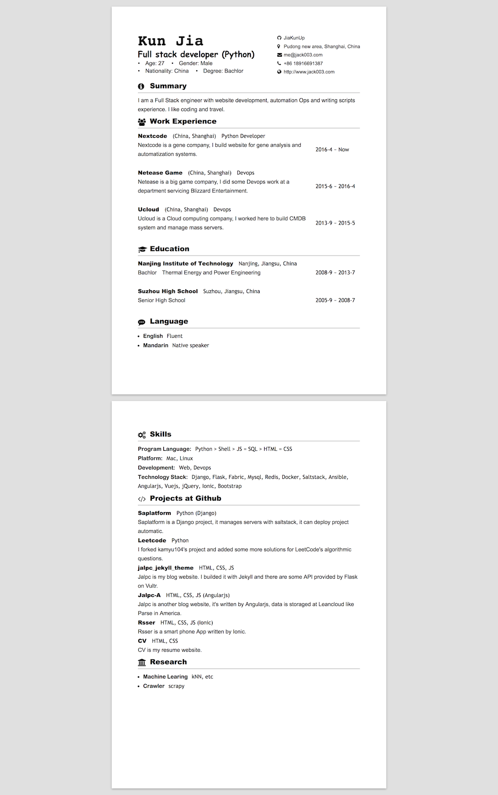

# My Curriculum Vitae

This website is written with jekyll and published at gh-pages. The page size is A4 paper.

## Usage

1. Fork this repo

2. Edit `_config.yml` to make sure it can run at your gh-pages.

3. edit `_data/*.yml` to edit your CV.

## Enjoy using it

You can open this CV page, and print/save PDF by click `cmd + p`.

## Example

## Credit

[paper-css](https://github.com/cognitom/paper-css)
